### 实现功能

1、NoteList界面中笔记条目增加时间戳显示

2、添加笔记查询功能（根据标题或内容查询）

3、UI美化：明、暗主题选择

4、笔记导出

### **具体效果**

**1、NoteList界面中笔记条目增加时间戳显示（显示上一次修改时间）**

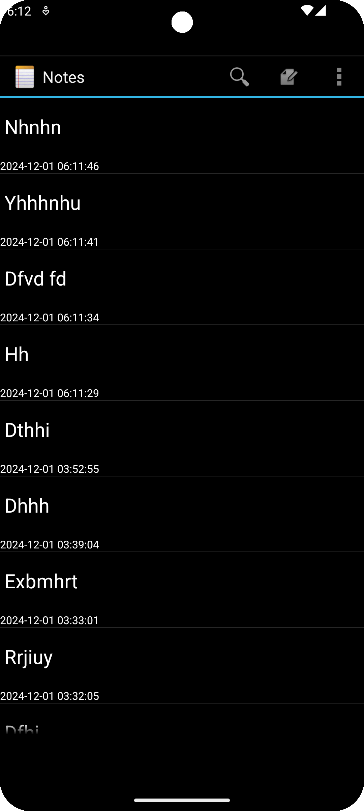

**2、添加笔记查询功能（点击放大镜根据标题或内容查询，弹出相应的笔记）**

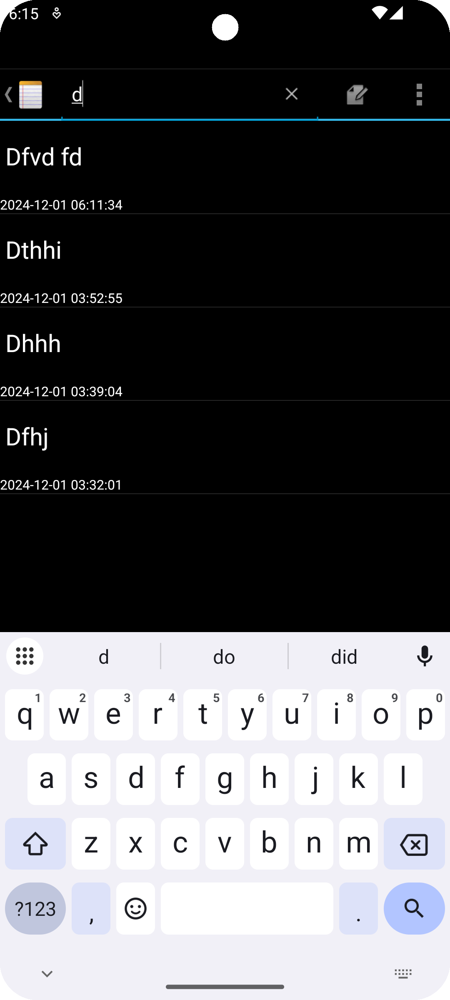

**3、UI美化：明、暗主题选择（默认主题为暗，可由菜单选项Theme选择明暗主题）**

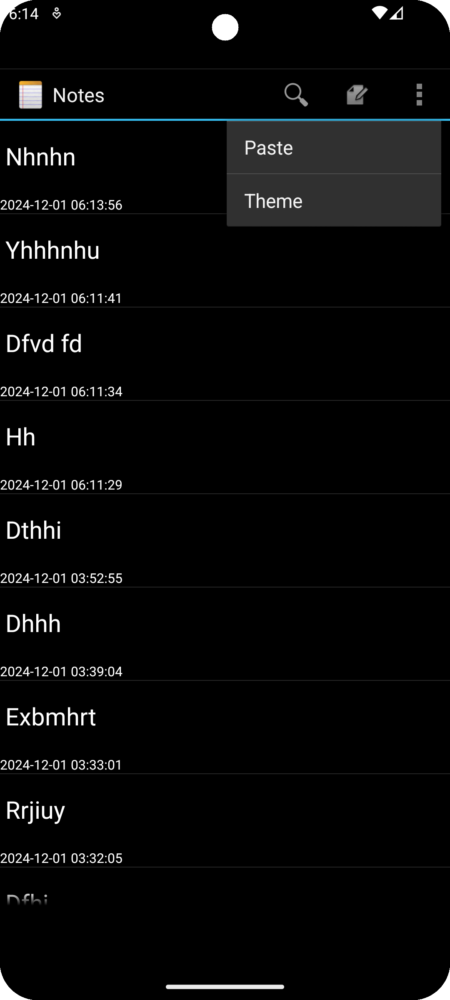

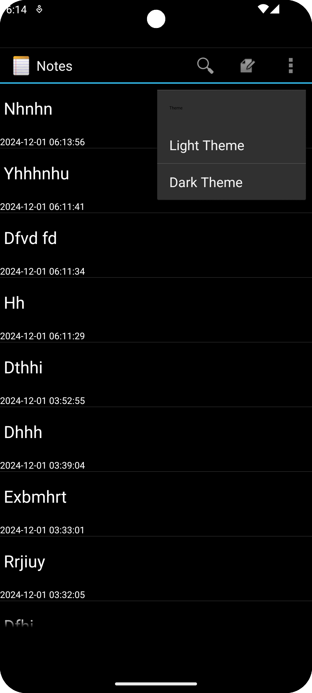

笔记列表亮主题

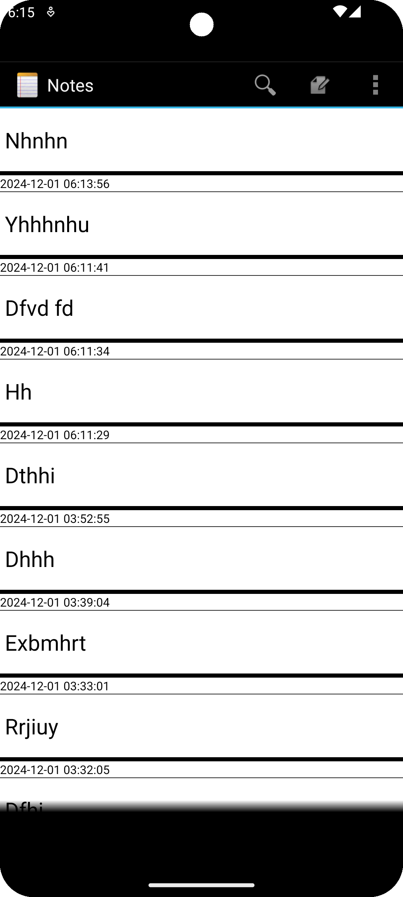

笔记编辑亮主题

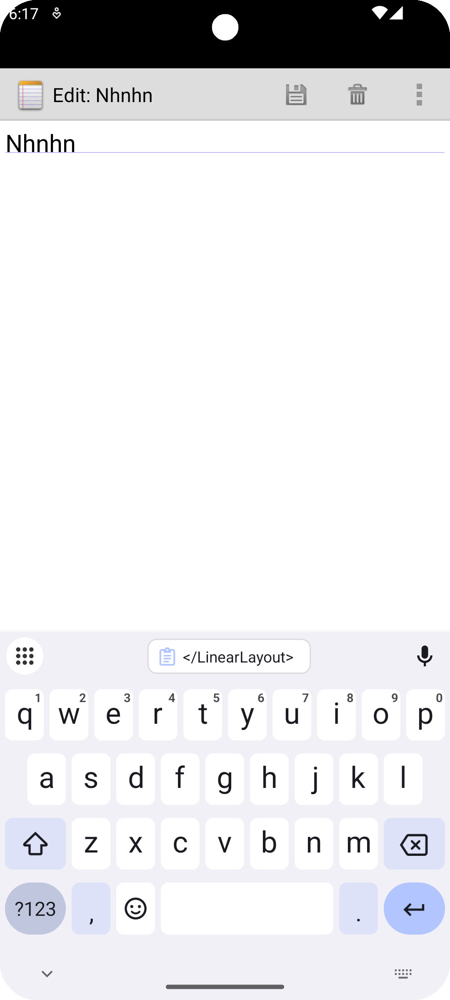

**4、笔记导出**

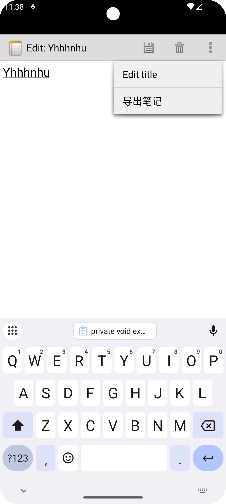

跳转入存储地址选择界面

导出成功

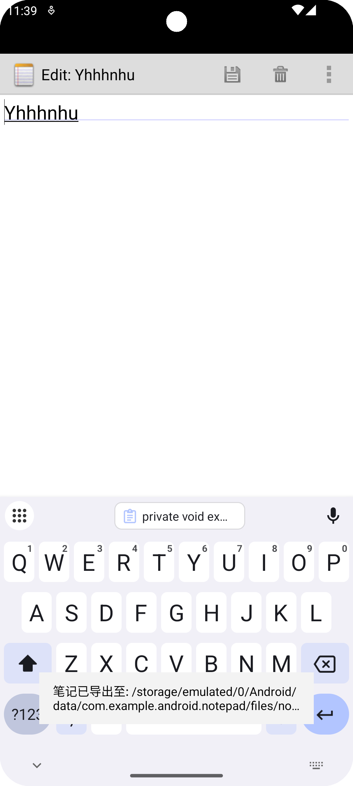

查看导出笔记

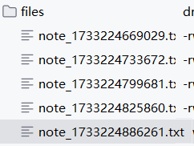

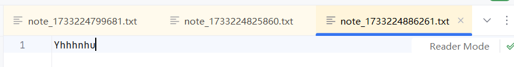

### **主要实现逻辑**

**1、NoteList界面中笔记条目增加时间戳显示**

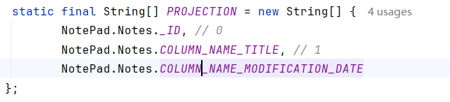

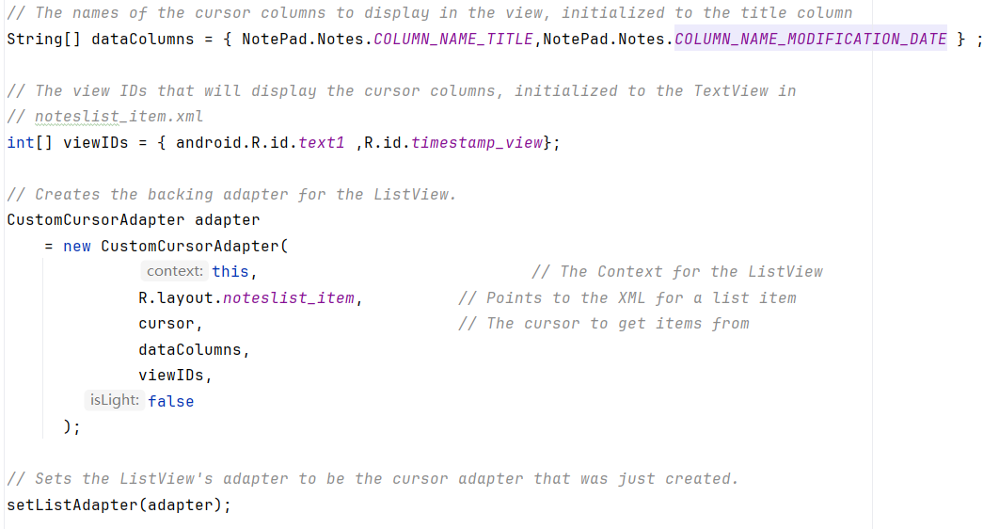

自建的CustomCursorAdapter类用于实现时间戳格式化和明暗主题

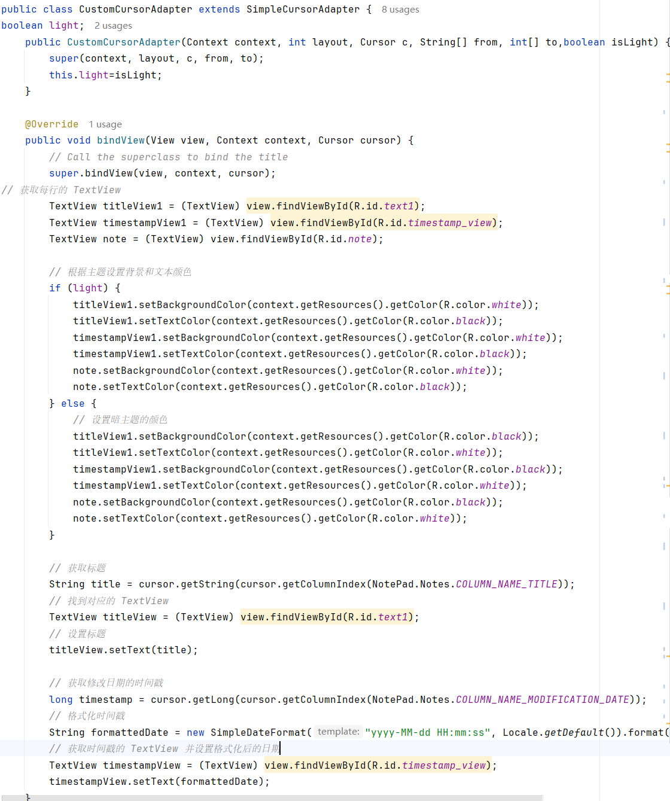

**2、添加笔记查询功能（根据标题或内容查询）**

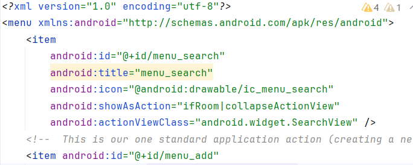

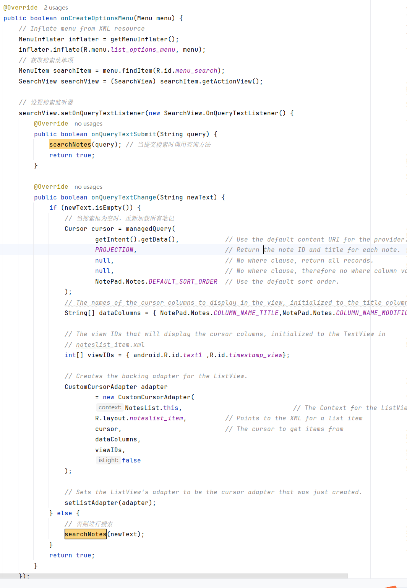

搜索逻辑

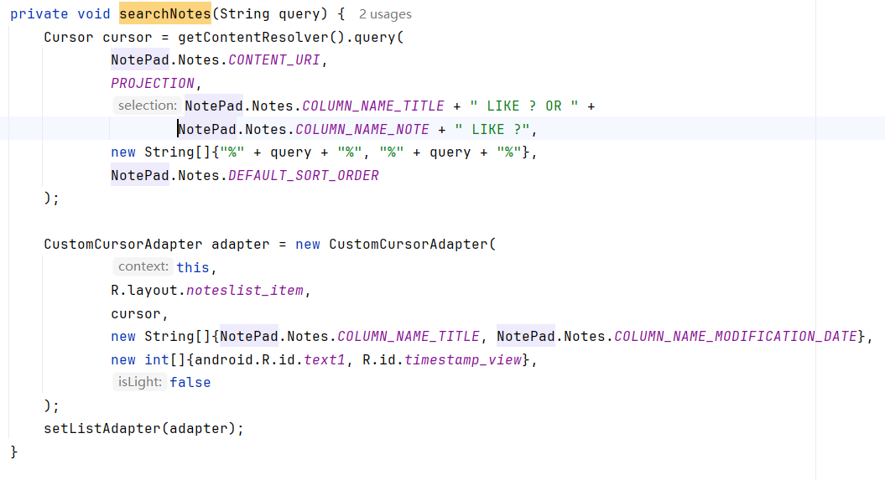

**3、UI美化：明、暗主题选择**

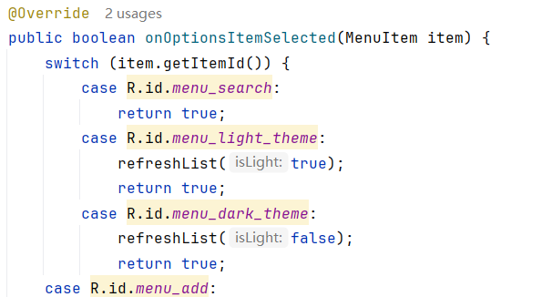

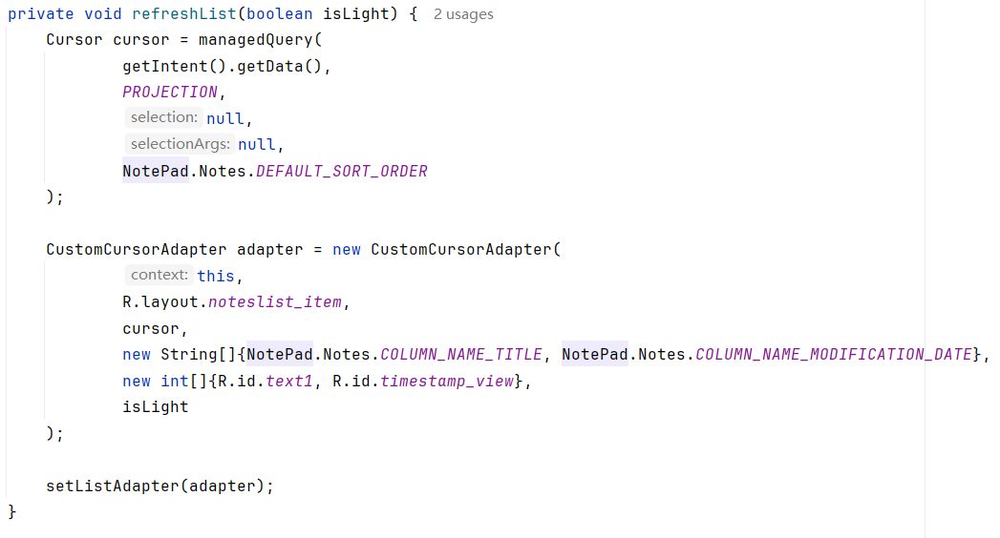

自建的CustomCursorAdapter类用于实现时间戳格式化和明暗主题

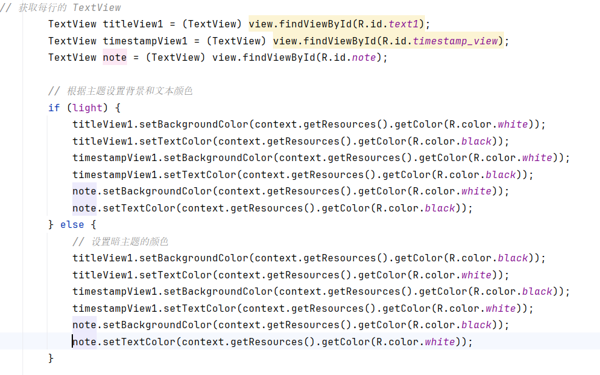

**4、笔记导出**

主要实现逻辑

